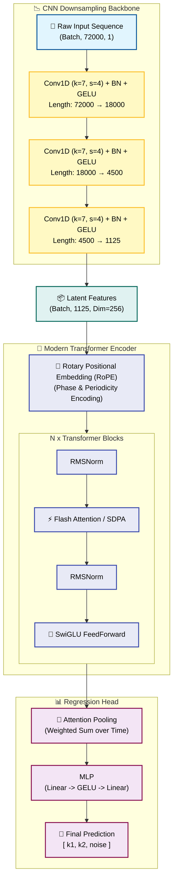
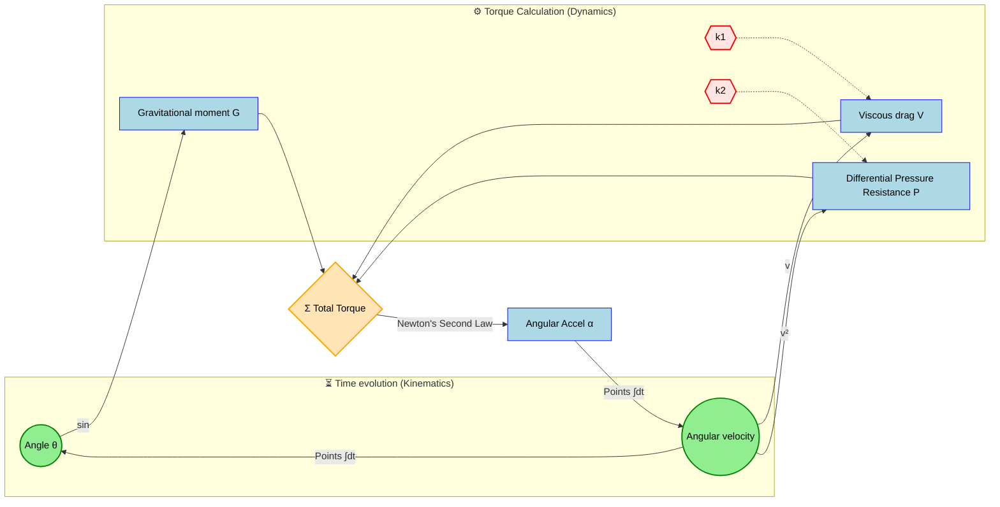
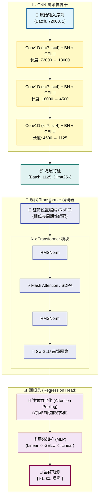
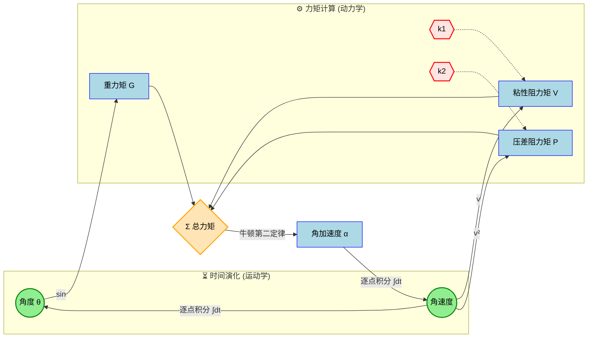

# <div align="center"> Hybrid Transformer Pendulum Estimator (HTPE)


<!-- Language Navigation / 语言导航 -->
<div align="center">

**[  English ](#-english)** | **[  中文 ](#-chinese-中文)**

</div>

---

<a id="-english"></a>

##  English

> **Precision Physical Parameter Inversion System based on Hybrid CNN-Transformer Architecture**
>
> Designed for **long-sequence, high-precision** physical experiments. This model accurately retrieves **linear damping** (material hysteresis) and **nonlinear drag** (aerodynamics) from **10-minute long** micro-amplitude trajectories of a **2cm steel ball** pendulum.

### 📚 Physics & Dynamics

#### 1. Governing Equation
For a **2cm solid steel ball** suspended by a fishing line under micro-amplitude oscillation, the system follows this nonlinear differential equation:

$$ \frac{d\omega}{dt} = \underbrace{-\frac{g}{L}\sin(\theta)}_{\text{Gravitational Torque}} - \underbrace{\frac{1}{m}(k_1 \omega + k_2 \omega |\omega|)}_{\text{Hybrid Damping Torque}} $$

| Parameter | Physical Meaning | Source Mechanism (This Exp.) | Typical Magnitude ($s^{-1}$) |
| :---: | :--- | :--- | :--- |
| **$k_1$** | **Linear Damping** | **Nylon Line Hysteresis** + Clamp Friction | $10^{-3} \sim 10^{-2}$ |
| **$k_2$** | **Quadratic Drag** | **Aerodynamic Drag** (Ball + String) | $\approx 10^{-3}$ |

> **⚠️ The Challenge**: Due to the extremely high density of the steel ball ($7850 kg/m^3$), the damping effect is incredibly weak ($Q \text{ Factor} \approx 1000$). Standard models struggle to extract these $10^{-3}$ magnitude features from noise.

### 🧠 Model Architecture

To handle **10-minute** sequences sampled at **120Hz** (Total Length: **72,000 points**), we utilize a **Hybrid CNN + Modern Transformer** architecture.

#### 1. Architectural Diagram



#### 2. Dynamics Feedback Loop
The diagram below illustrates how physical parameters ($k_1, k_2$) intervene in the system, affecting state evolution through torque:



#### 3. Key Tech Stack
*   **1D CNN Backbone**: Compresses the 72k-length physical signal by **64x**, extracting high-order dynamic features while reducing computational cost.
*   **RoPE (Rotary Embedding)**: Encodes relative positions using rotation matrices, perfectly capturing the **phase and periodicity** of the pendulum.
*   **SwiGLU & RMSNorm**: Components adopted from Llama/PaLM architectures for faster convergence and training stability.
*   **Attention Pooling**: A learnable weighting mechanism that automatically focuses on the most informative signal segments (e.g., high-velocity regions).

### 🚀 Quick Start

#### 1. Environment Setup
Recommended: Linux environment with NVIDIA GPU (for FlashAttention support).

```bash
# Create Conda environment
conda create -n pendulum python=3.10
conda activate pendulum

# Install PyTorch (CUDA 11.8+ recommended)
pip install torch torchvision --index-url https://download.pytorch.org/whl/cu118

# Install core dependencies
pip install -r requirements.txt

# (Optional) Install FlashAttention for acceleration
pip install flash-attn --no-build-isolation
```

#### 2. Data Generation
Generate a high-precision dataset based on **2cm steel ball physics** (Output includes Time and Angle columns).

```bash
python scripts/generate_data.py
```

#### 3. Training
Start training using Hydra configuration management.

```bash
python train.py
```
*   **Override params CLI**: `python train.py train.global_batch_size=32 train.optimizer.lr=1e-4`
*   **Logs**: Experiments are automatically saved in `outputs/YYYY-MM-DD/HH-MM-SS/`.

### ⚙️ Configuration

Core settings are located in `conf/config.yaml`, pre-configured for precision experiments:

```yaml
physics:
  m: 0.033        
  L: 1.0       
  t_max: 600.0    
  dt: 0.008333    

# Generation Ranges (Based on Physics Literature)
generation:
  k1_range: [0.001, 0.030] 
  k2_range: [0.0010, 0.0080] 

# Model Hyperparameters
model:
  model_dim: 256
  num_layers: 4
  input_dim: 1    
```

### 📂 Project Structure

```text
pendulum_server/
├── ⚙️ conf/                 # Hydra Configs
│   ├── config.yaml         # Main Config
│   └── model/              # Model Architecture Configs
├── 🏭 data/                 # Data Handling
│   └── dataset.py          # Standalone Dataset (Time/Angle parsing)
├── 🧠 models/               # Model Definitions
│   ├── layers.py           # RoPE, SwiGLU, RMSNorm
│   └── transformer.py      # Hybrid CNN-Transformer
├── 📜 scripts/              # Helper Scripts
│   └── generate_data.py    # Physics Simulator
├── 🛠️ utils/                # Utilities
│   ├── common.py           # Seeding, Logging
│   └── functions.py        # Dynamic Loading
└── 🚀 train.py              # Main Training Entry
```

### 📈 Expected Performance

Under extremely weak signal conditions ($k_1, k_2 \approx 10^{-3}$):

| Parameter | MAE Tolerance | Description |
| :--- | :--- | :--- |
| **$k_1$ (Linear)** | `< 0.002` | Can distinguish between nylon lines of different aging stages. |
| **$k_2$ (Quadratic)** | `< 0.0005` | **High Precision**. Can detect drag differences from 0.1mm diameter variations. |
| **Noise Level** | `< 0.005` | Accurately estimates sensor Signal-to-Noise Ratio (SNR). |

---

<br>
<hr>
<br>

<a id="-chinese-中文"></a>

## 中文 (Chinese)

> **基于混合 CNN-Transformer 架构的精密物理参数反演系统**
>
> 专为**长序列、高精度**物理实验设计。该模型能够从 **2cm 钢球单摆**的**10分钟长**微幅轨迹中，精确反演**线性阻尼**（材料迟滞）和**非线性阻力**（空气动力学）。

### 📚 物理与动力学

#### 1. 控制方程 (Governing Equation)
对于悬挂在尼龙鱼线上进行微幅振荡的 **2cm 实心钢球**，系统遵循以下非线性微分方程：

$$ \frac{d\omega}{dt} = \underbrace{-\frac{g}{L}\sin(\theta)}_{\text{重力矩}} - \underbrace{\frac{1}{m}(k_1 \omega + k_2 \omega |\omega|)}_{\text{混合阻尼力矩}} $$

| 参数 | 物理含义 | 来源机制 (本实验) | 典型量级 ($s^{-1}$) |
| :---: | :--- | :--- | :--- |
| **$k_1$** | **线性阻尼** | **尼龙线迟滞** + 夹具摩擦 | $10^{-3} \sim 10^{-2}$ |
| **$k_2$** | **二次项阻力** | **空气动力学阻力** (球体+线) | $\approx 10^{-3}$ |

> **⚠️ 挑战**：由于钢球密度极高 ($7850 kg/m^3$)，阻尼效应极其微弱 ($Q \text{ Factor} \approx 1000$)。标准模型很难从噪声中提取这些 $10^{-3}$ 量级的特征。

### 🧠 模型架构

为了处理采样率为 **120Hz** 的 **10分钟** 序列（总长度：**72,000 点**），我们采用了 **混合 CNN + 现代 Transformer** 架构。

#### 1. 架构图



#### 2. 动力学反馈循环
下图展示了物理参数 ($k_1, k_2$) 如何介入系统，通过力矩影响状态演化：



#### 3. 核心技术栈
*   **1D CNN Backbone**: 将 72k 长度的物理信号压缩 **64倍**，在降低计算成本的同时提取高阶动态特征。
*   **RoPE (旋转位置编码)**: 使用旋转矩阵对相对位置进行编码，完美捕捉单摆的**相位和周期性**。
*   **SwiGLU & RMSNorm**: 借鉴 Llama/PaLM 架构的组件，用于加快收敛速度并提高训练稳定性。
*   **Attention Pooling**: 一种可学习的加权机制，自动关注信息量最大的信号片段（例如速度较高的区域）。

### 🚀 快速开始

#### 1. 环境安装
推荐：具有 NVIDIA GPU 的 Linux 环境（支持 FlashAttention）。

```bash
# 创建 Conda 环境
conda create -n pendulum python=3.10
conda activate pendulum

# 安装 PyTorch (推荐 CUDA 11.8+)
pip install torch torchvision --index-url https://download.pytorch.org/whl/cu118

# 安装核心依赖
pip install -r requirements.txt

# (可选) 安装 FlashAttention 加速库
pip install flash-attn --no-build-isolation
```

#### 2. 数据生成
基于 **2cm 钢球物理模型** 生成高精度数据集（输出包含 Time 和 Angle 列）。

```bash
python scripts/generate_data.py
```

#### 3. 训练
使用 Hydra 配置管理启动训练。

```bash
python train.py
```
*   **命令行覆盖参数**: `python train.py train.global_batch_size=32 train.optimizer.lr=1e-4`
*   **日志**: 实验结果自动保存于 `outputs/YYYY-MM-DD/HH-MM-SS/`。

### ⚙️ 配置说明

核心设置位于 `conf/config.yaml`，已针对精密实验进行预配置：

```yaml
physics:
  m: 0.033        # 质量 (kg)
  L: 1.0          # 摆长 (m)
  t_max: 600.0    # 时长 (s)
  dt: 0.008333    # 时间步长 (120Hz)

# 生成范围 (基于物理文献)
generation:
  k1_range: [0.001, 0.030] 
  k2_range: [0.0010, 0.0080] 

# 模型超参数
model:
  model_dim: 256
  num_layers: 4
  input_dim: 1    
```

### 📂 项目结构

```text
pendulum_server/
├── ⚙️ conf/                 # Hydra 配置文件
│   ├── config.yaml         # 主配置
│   └── model/              # 模型架构配置
├── 🏭 data/                 # 数据处理
│   └── dataset.py          # 独立 Dataset (解析 Time/Angle)
├── 🧠 models/               # 模型定义
│   ├── layers.py           # RoPE, SwiGLU, RMSNorm
│   └── transformer.py      # 混合 CNN-Transformer
├── 📜 scripts/              # 辅助脚本
│   └── generate_data.py    # 物理模拟器
├── 🛠️ utils/                # 工具库
│   ├── common.py           # 随机种子, 日志
│   └── functions.py        # 动态加载
└── 🚀 train.py              # 训练主入口
```

### 📈 预期性能

在极弱信号条件下 ($k_1, k_2 \approx 10^{-3}$)：

| 参数 | MAE 容差 | 描述 |
| :--- | :--- | :--- |
| **$k_1$ (线性)** | `< 0.002` | 可区分不同老化阶段的尼龙线。 |
| **$k_2$ (二次项)** | `< 0.0005` | **高精度**。可检测出 0.1mm 直径变化引起的阻力差异。 |
| **噪声水平** | `< 0.005` | 准确估算传感器信噪比 (SNR)。 |
```


