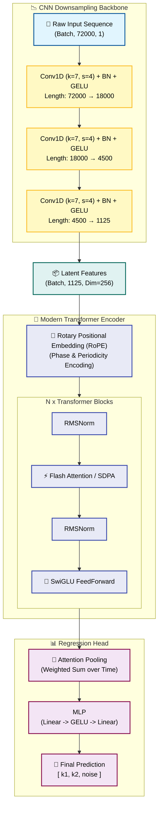
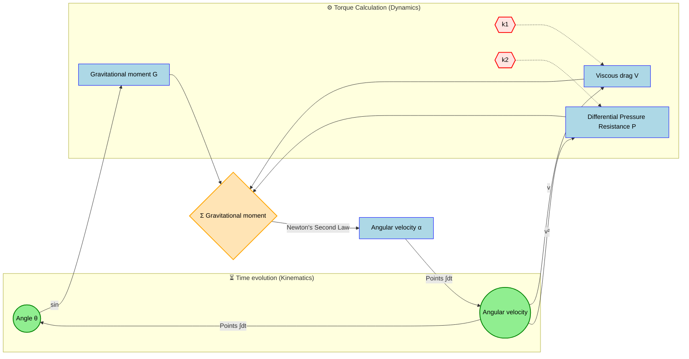

# Hybrid Transformer Pendulum Estimator (HTPE)


> **Precision Physical Parameter Inversion System based on Hybrid CNN-Transformer Architecture**
>
> Designed for **long-sequence, high-precision** physical experiments. This model accurately retrieves **linear damping** (material hysteresis) and **nonlinear drag** (aerodynamics) from **10-minute long** micro-amplitude trajectories of a **2cm steel ball** pendulum.

---

## 📚 Physics & Dynamics

### 1. Governing Equation
For a **2cm solid steel ball** suspended by a fishing line under micro-amplitude oscillation, the system follows this nonlinear differential equation:

$$ \frac{d\omega}{dt} = \underbrace{-\frac{g}{L}\sin(\theta)}_{\text{Gravitational Torque}} - \underbrace{\frac{1}{m}(k_1 \omega + k_2 \omega |\omega|)}_{\text{Hybrid Damping Torque}} $$

| Parameter | Physical Meaning | Source Mechanism (This Exp.) | Typical Magnitude ($s^{-1}$) |
| :---: | :--- | :--- | :--- |
| **$k_1$** | **Linear Damping** | **Nylon Line Hysteresis** + Clamp Friction | $10^{-3} \sim 10^{-2}$ |
| **$k_2$** | **Quadratic Drag** | **Aerodynamic Drag** (Ball + String) | $\approx 10^{-3}$ |

> **⚠️ The Challenge**: Due to the extremely high density of the steel ball ($7850 kg/m^3$), the damping effect is incredibly weak ($Q \text{ Factor} \approx 1000$). Standard models struggle to extract these $10^{-3}$ magnitude features from noise.

---

## 🧠 Model Architecture

To handle **10-minute** sequences sampled at **120Hz** (Total Length: **72,000 points**), we utilize a **Hybrid CNN + Modern Transformer** architecture.

### 1. Architectural Diagram


### 2. 动力学反馈循环 (System Loop)
下图展示了物理参数 ($k_1, k_2$) 如何介入系统，通过力矩影响状态演化：



---
### 3. Key Tech Stack
*   **1D CNN Backbone**: Compresses the 72k-length physical signal by **64x**, extracting high-order dynamic features while reducing computational cost.
*   **RoPE (Rotary Embedding)**: Encodes relative positions using rotation matrices, perfectly capturing the **phase and periodicity** of the pendulum.
*   **SwiGLU & RMSNorm**: Components adopted from Llama/PaLM architectures for faster convergence and training stability.
*   **Attention Pooling**: A learnable weighting mechanism that automatically focuses on the most informative signal segments (e.g., high-velocity regions).

---

## 🚀 Quick Start

### 1. Environment Setup
Recommended: Linux environment with NVIDIA GPU (for FlashAttention support).

```bash
# Create Conda environment
conda create -n pendulum python=3.10
conda activate pendulum

# Install PyTorch (CUDA 11.8+ recommended)
pip install torch torchvision --index-url https://download.pytorch.org/whl/cu118

# Install core dependencies
pip install -r requirements.txt

# (Optional) Install FlashAttention for acceleration
pip install flash-attn --no-build-isolation
```

### 2. Data Generation
Generate a high-precision dataset based on **2cm steel ball physics** (Output includes Time and Angle columns).

```bash
python scripts/generate_data.py
```

### 3. Training
Start training using Hydra configuration management.

```bash
python train.py
```
*   **Override params CLI**: `python train.py train.global_batch_size=32 train.optimizer.lr=1e-4`
*   **Logs**: Experiments are automatically saved in `outputs/YYYY-MM-DD/HH-MM-SS/`.

---

## ⚙️ Configuration

Core settings are located in `conf/config.yaml`, pre-configured for precision experiments:

```yaml
physics:
  m: 0.033        
  L: 1.0       
  t_max: 600.0    
  dt: 0.008333    

# Generation Ranges (Based on Physics Literature)
generation:
  k1_range: [0.001, 0.030] 
  k2_range: [0.0010, 0.0080] 

# Model Hyperparameters
model:
  model_dim: 256
  num_layers: 4
  input_dim: 1    
```

---

## 📂 Project Structure

```text
pendulum_server/
├── ⚙️ conf/                 # Hydra Configs
│   ├── config.yaml         # Main Config
│   └── model/              # Model Architecture Configs
├── 🏭 data/                 # Data Handling
│   └── dataset.py          # Standalone Dataset (Time/Angle parsing)
├── 🧠 models/               # Model Definitions
│   ├── layers.py           # RoPE, SwiGLU, RMSNorm
│   └── transformer.py      # Hybrid CNN-Transformer
├── 📜 scripts/              # Helper Scripts
│   └── generate_data.py    # Physics Simulator
├── 🛠️ utils/                # Utilities
│   ├── common.py           # Seeding, Logging
│   └── functions.py        # Dynamic Loading
└── 🚀 train.py              # Main Training Entry
```

---

## 📈 Expected Performance

Under extremely weak signal conditions ($k_1, k_2 \approx 10^{-3}$):

| Parameter | MAE Tolerance | Description |
| :--- | :--- | :--- |
| **$k_1$ (Linear)** | `< 0.002` | Can distinguish between nylon lines of different aging stages. |
| **$k_2$ (Quadratic)** | `< 0.0005` | **High Precision**. Can detect drag differences from 0.1mm diameter variations. |
| **Noise Level** | `< 0.005` | Accurately estimates sensor Signal-to-Noise Ratio (SNR). |